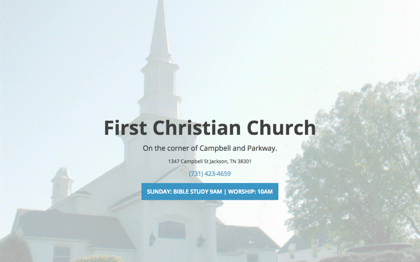

# FCC
FCC site code base

Current Screenshot

##Local Dev Setup
- [install Node](https://nodejs.org/en/download/)
- open terminal
- install Gulp globally: `npm install --global gulp`
- `npm install`
- `gulp watch` Gulp will watch your LESS files and compile to CSS.
- You're off to the races!

##What is LESS?
http://lesscss.org/

##If wanting to add multiple pages with a simple blog...
Might look into running this page through a [Jykell install](https://help.github.com/articles/using-jekyll-as-a-static-site-generator-with-github-pages/).